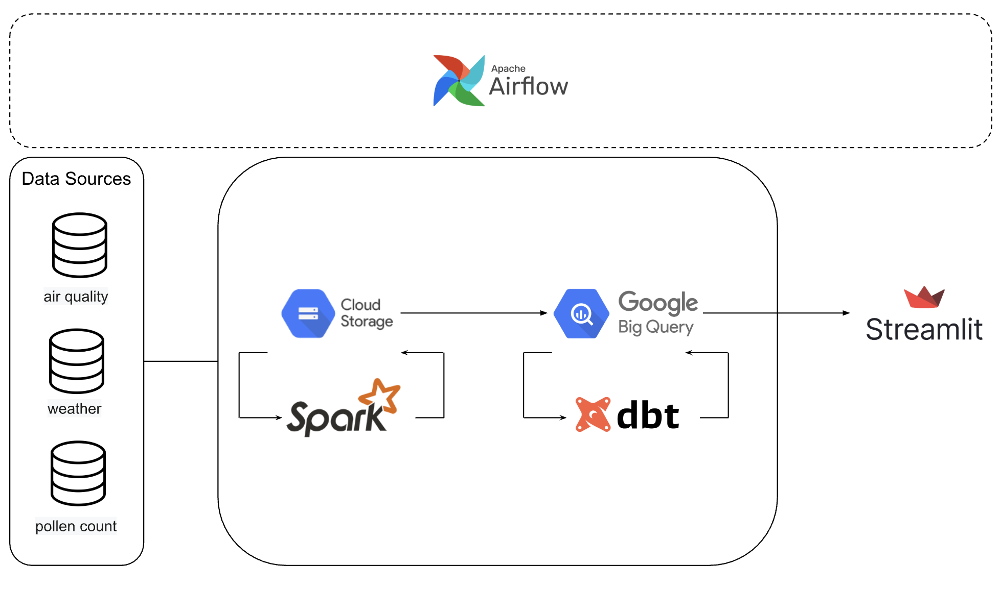

# 🌤️ GoOutside – Your Daily Environmental Dashboard

**GoOutside** is a modular data engineering project that collects, processes, analyzes, and visualizes real-time weather, air quality, and pollen data. It's built for anyone interested in environmental insights — whether you're an athlete, a parent, or just someone planning their day.


## 📊 Key Features

- **Automated ingestion** from public APIs (DWD, Umweltbundesamt, BrightSky) using Python & `requests`
- **Data lake architecture**: JSON + Parquet in Google Cloud Storage (GCS)
- **Apache Spark** for fast batch transformation from raw to columnar formats
- **Data modeling** with `dbt` into clean, analytics-ready BigQuery tables
- **Airflow DAGs** to orchestrate ingestion, transformation & modeling
- **Streamlit dashboard** for interactive environmental insights
- **FastAPI** as optional REST interface (e.g. for manual ingestion or ML prediction)


## 🧰 Tech Stack

| Tool / Service          | Role                                          |
|--------------------------|-----------------------------------------------|
| **Docker**              | Containerization & local reproducibility      |
| **Airflow**             | Workflow orchestration (ETL)                  |
| **Spark**               | Data transformation (JSON → Parquet)          |
| **Python + requests**   | API ingestion layer                           |
| **FastAPI**             | Optional HTTP interface for triggering/prediction |
| **Google Cloud Storage**| Raw + processed storage (data lake)           |
| **BigQuery**            | Cloud data warehouse                          |
| **dbt**                 | SQL modeling (staging, DWH, OBT)              |
| **Streamlit**           | Dashboard frontend                            |

## ⚙️ Project Architecture



## 🚀 Getting Started

```bash
# Clone the repo
git clone https://github.com/benigram/gooutside.git
cd gooutside

# Start Airflow & other services
docker compose up airflow-init
docker compose up
```

## 🌤️ Final result


## ✨ Ideas for Further Work
While the current pipeline is fully functional, there are several opportunities to extend and improve the project:
- Set up CI/CD integration
- Add monitoring and alerts
- Integrate machine learning models
- Expand the Streamlit dashboard
- Backfill historical data
- Implement data quality checks
- Add tests to dbt models
